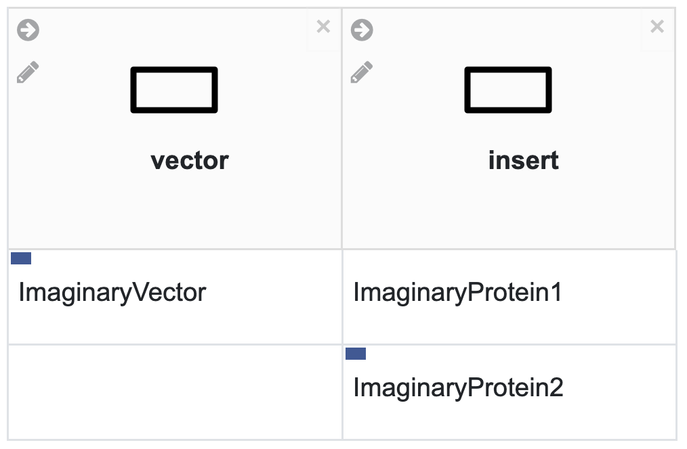
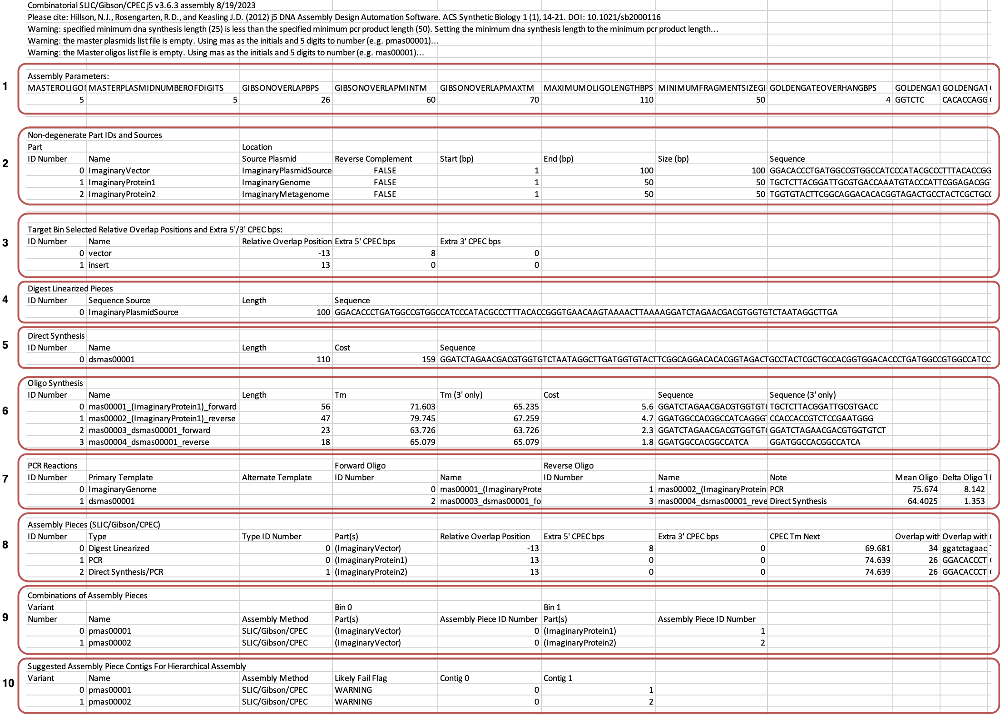
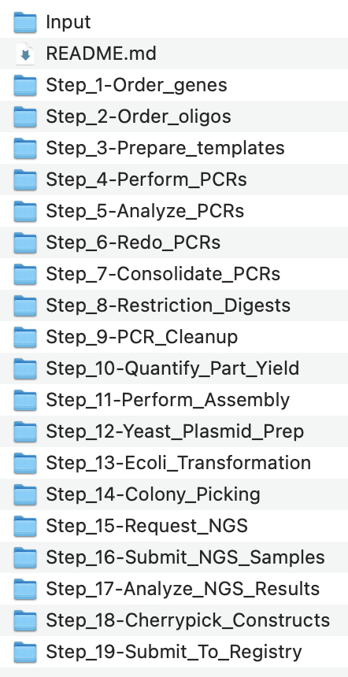

# DNAda

DNAda is a web application that integrates the [j5](https://j5.jbei.org)
DNA assembly software with robotic liquid handlers.

## Background

J5 is a powerful DNA assembly software that can be used to design
and optimize DNA assembly protocols. However, it is not directly compatible with
robotic liquid handlers. DNAda is a web/command-line application
that integrates j5 with robotic liquid handlers by converting a
j5 assembly design into a series of liquid handler compatible instructions.
This enables a user without progamming experience to design DNA assembly
protocols on a user-friendly
canvas, [DeviceEditor](https://j5.jbei.org/DeviceEditor_manual/index.html),
and then convert the design using J5 and subsequently DNAda into a series
of instructions that can be executed on a liquid handler .

## Example

As a simple demonstration, the J5 output of this simple DNA assembly is provided
in the `examples/` directory of this repository:

<p align="center">
  
</p>

In this design, we want to insert two imaginary proteins into an imaginary
vector. We are assuming that we get a stock of the imaginary vector from a 3rd-party
service such as [Addgene](https://www.addgene.org) and that we want to prepare/linearize
this vector using restriction enzymes (denoted by the blue box in the left-hand corner
of the ImaginaryVector box). We are amplifying ImaginaryProtein1 off of the
genome of some organism that we have access to. And lastly we genome mined ImaginaryProtein2
from a metagenomic database and thus don't have access to source genetic material, which
means we will have to synthesize a DNA fragment containing its sequence (denoted by the
blue box in the left-hand corner of the ImaginaryProtein2 box).

We used J5 to create Gibson assembly instructions for these two plasmids using default
parameters with the exception of the `Minimum Gibson Fragment Size BPs` and
`Minimum DNA Synthesis Length bps` which we reduced to 50 bps to enable this toy
example.

The J5 design generates many design files, you are directed to view the
[j5 documentation](https://j5usermanual.lbl.gov/) for a more thorough explanation of
each file's purpose. The files most relevant to DNAda are:

- pmas00001.gb and pmas00002.gb: [Genbank-formatted](https://www.ncbi.nlm.nih.gov/Sitemap/samplerecord.html) final plasmid maps
- pmas00001_combinatorial.csv: Combinatorial design file serving as main input to DNAda

The combinatorial csv combines instructions for assembling each plasmid in the design
into a single file.

<p align="center">
  
</p>

All that is missing is physical instantiations of each object to enable sample
tracking and automated robotic manipulation. DNAda provides that by first
optionally consolidating multiple J5 designs into a single design that is then
used to generate step-by-step liquid-handler compatible instructions.

The DNAda CLI is the quickest way to generate automation instructions. See below
for installation instructions.

```bash
dnada_cli.py examples/example_j5_output.zip
```

<p align="center">
  
</p>

## CLI Installation

Note, it is highly recommended to use a virtual environment to install the dependencies.

For example,

```bash
wget "https://github.com/conda-forge/miniforge/releases/latest/download/Mambaforge-$(uname)-$(uname -m).sh"
bash Mambaforge-$(uname)-$(uname -m).sh
source ~/mambaforge/bin/activate
mamba create -y -n dnada
conda activate dnada
mamba install -y python==3.11.4
```

```bash
pip install dnada
```

Alternatively, setup from the source code by running

```bash
git clone https://github.com/JBEI/dnada.git
cd dnada/backend/app
python setup.py install
```

After installation, you should have `dnada-cli.py` in your path:

```bash
Usage: dnada_cli.py [OPTIONS] FILES...

  Condense j5 design zip files into single design then create customized
  automation instructions for J5 Design.

Arguments:
  FILES...  [required]

Options:
  --output PATH                   Path to save the output file.  [default:
                                  automation_instructions.zip]
  --install-completion [bash|zsh|fish|powershell|pwsh]
                                  Install completion for the specified shell.
  --show-completion [bash|zsh|fish|powershell|pwsh]
                                  Show completion for the specified shell, to
                                  copy it or customize the installation.
  --help                          Show this message and exit.
```

## Local App Deployment

Copy `.env.template` to `.env` and replace variables with appropriate values.

Then start the stack
with [Docker Compose](https://docs.docker.com/compose/):

```bash
docker compose up -d
```

Now you can open your browser and interact with these URLs:

| Service               | Description                                                  | URL                      |
| --------------------- | ------------------------------------------------------------ | ------------------------ |
| Frontend              | built with Docker, with routes handled based on the path     | <http://localhost>       |
| Backend               | JSON based web API based on OpenAPI                          | <http://localhost/api/>  |
| Swagger documentation | Automatic interactive documentation from the OpenAPI backend | <http://localhost/docs>  |
| ReDoc documentation   | Alternative automatic documentation from the OpenAPI backend | <http://localhost/redoc> |
| Flower                | administration of Celery tasks                               | <http://localhost:5555>  |
| Traefik UI            | to see how the routes are being handled by the proxy         | <http://localhost:8090>  |

**Note**: The first time you start your stack, it might take a minute for it to be ready. While the backend waits for the database to be ready and configures everything. You can check the logs to monitor it.

To check the logs, run:

```bash
docker-compose logs --follow
```

To check the logs of a specific service, add the name of the service, e.g.:

```bash
docker-compose logs backend --follow
```

## Testing the stack

Since the source code is mounted as a volume within the backend app container during development
, you can run tests on the live-reloading code:

```Bash
docker-compose exec backend /app/tests-start.sh
```

That `/app/tests-start.sh` script just calls `pytest` after making sure that the rest of the stack is running. If you need to pass extra arguments to `pytest`, you can pass them to that command and they will be forwarded.

For example, to stop on first error:

```bash
docker-compose exec backend bash /app/tests-start.sh -x
```

## Database Migrations

As during local development your app directory is mounted as a volume inside the container, you can also run the migrations with `alembic` commands inside the container and the migration code will be in your app directory (instead of being only inside the container). So you can add it to your git repository.

Make sure you create a "revision" of your models and that you "upgrade" your database with that revision every time you change them. As this is what will update the tables in your database. Otherwise, your application will have errors.

- Start an interactive session in the backend container:

```console
$ docker-compose exec backend bash
```

- If you created a new model in `./backend/app/app/models/`, make sure to import it in `./backend/app/app/db/base.py`, that Python module (`base.py`) that imports all the models will be used by Alembic.

- After changing a model (for example, adding a column), inside the container, create a revision, e.g.:

```console
$ alembic revision --autogenerate -m "Add column last_name to User model"
```

- Commit to the git repository the files generated in the alembic directory.

- After creating the revision, run the migration in the database (this is what will actually change the database):

```console
$ alembic upgrade head
```

## Frontend development

- Enter the `frontend` directory, install the NPM packages and start the live server using the `npm` scripts:

```bash
cd frontend
npm install
npm run serve
```

Then open your browser at <http://localhost:8080>

Notice that this live server is not running inside Docker, it is for local development, and that is the recommended workflow. Once you are happy with your frontend, you can build the frontend Docker image and start it, to test it in a production-like environment. But compiling the image at every change will not be as productive as running the local development server with live reload.

Check the file `package.json` to see other available options.

## Production Deployment

You can deploy the stack to a Docker Swarm mode cluster with a main Traefik proxy, set up using the ideas from <a href="https://dockerswarm.rocks" target="_blank">DockerSwarm.rocks</a>, to get automatic HTTPS certificates, etc.

Briefly, after setting up a docker swarm there are 2 main steps:

1. **Build** app images
1. **Deploy** stack

---

Here are the steps in detail:

1. **Build app images**

- Set these environment variables, right before the next command:
  - `TAG=prod`
  - `FRONTEND_ENV=production`
- Use the provided `scripts/build.sh` file with those environment variables:

```bash
TAG=prod FRONTEND_ENV=production bash ./scripts/build.sh
```

1. **Deploy stack**

- Set these environment variables:
  - `DOMAIN=dnada.io`
  - `TRAEFIK_TAG=dnada.io`
  - `STACK_NAME=dnada-io`
  - `TAG=prod`
- Use the provided `scripts/deploy.sh` file with those environment variables:

```bash
DOMAIN=cloudenzymes.com \
TRAEFIK_TAG=cloudenzymes.com \
STACK_NAME=cloudenzymes-com \
TAG=prod \
bash ./scripts/deploy.sh
```

---

## Docker Compose files and env vars

There is a main `docker-compose.yml` file with all the configurations that apply to the whole stack, it is used automatically by `docker-compose`.

And there's also a `docker-compose.override.yml` with overrides for development, for example to mount the source code as a volume. It is used automatically by `docker-compose` to apply overrides on top of `docker-compose.yml`.

These Docker Compose files use the `.env` file containing configurations to be injected as environment variables in the containers.

They also use some additional configurations taken from environment variables set in the scripts before calling the `docker-compose` command.

### The .env file

The `.env` file is the one that contains all your configurations, generated keys and passwords, etc.

Depending on your workflow, you could want to exclude it from Git, for example if your project is public. In that case, you would have to make sure to set up a way for your CI tools to obtain it while building or deploying your project.

One way to do it could be to add each environment variable to your CI/CD system, and updating the `docker-compose.yml` file to read that specific env var instead of reading the `.env` file.

## Acknowledgements

DNAda was in part based on this
[repository](https://github.com/tiangolo/full-stack-fastapi-postgresql)
and depends on the following separate libraries and packages:

- Alembic
- Biopython
- Celery
- Fastapi
- k_means_constrained
- Matplotlib
- Numpy
- Pandas
- Pandera
- Psycopg2-binary
- Pydantic
- Requests
- Scipy
- Seaborn
- SQLAlchemy
- VueJS

We thank all their contributors and maintainers!
